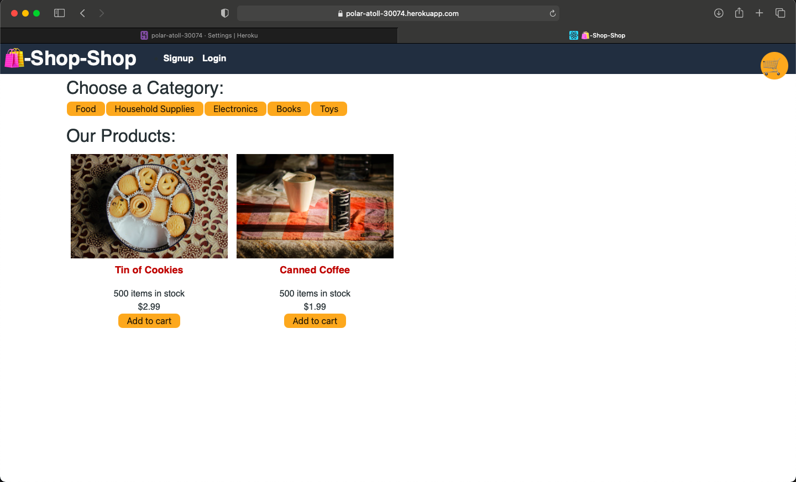
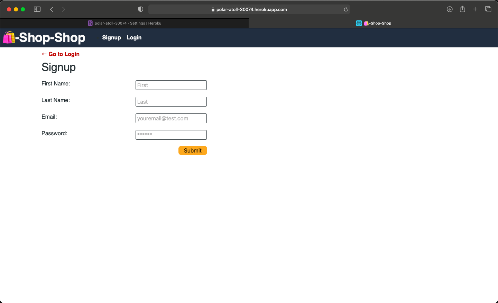
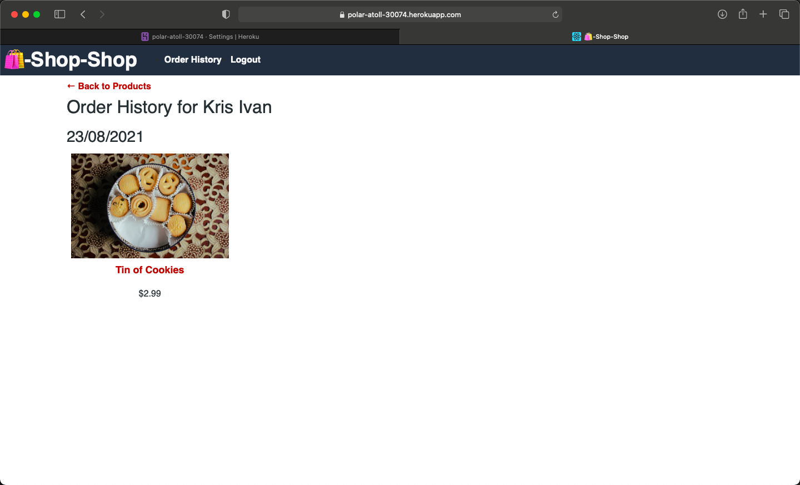
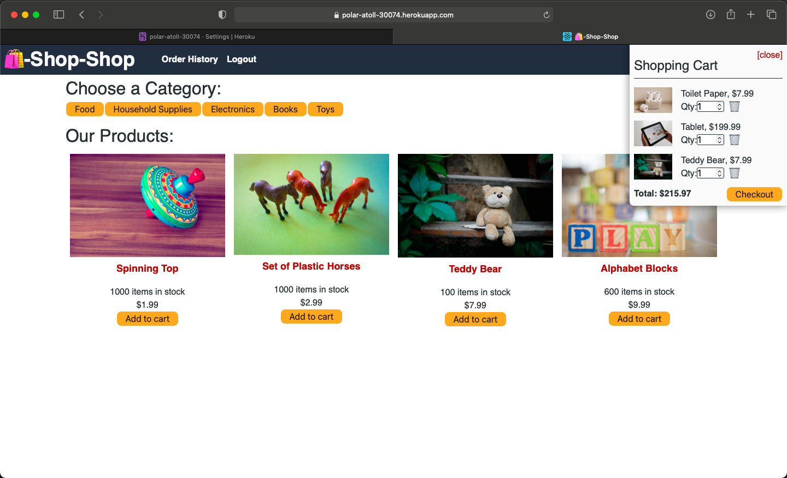

# E-commerce Store - Redux

## Description

In this project I have created an e-commerce store using Redux to manage global state with a GraphQl server and React client.

## What I have done

- [x] Refactored previous code to allow Redux to manage global state
- [x] Deployed to Heroku with AtlasDB

## Installation

```
git clone https://github.com/ivnkris/ecommerce-store-redux
cd ecommerce-store-redux
npm install
```

Set up and connect to MongoDB on your local machine

```
npm run seed
npm run develop
```

## Contributing

Submit a pull request

## Scripts

```
npm run start
npm run develop
npm run seed
npm run build
```

## Link to GitHub repository

https://github.com/ivnkris/ecommerce-store-redux

## Link to deployed application

https://polar-atoll-30074.herokuapp.com

## Screenshots






## Questions

- Send any questions via my [GitHub profile](https://github.com/ivnkris)
